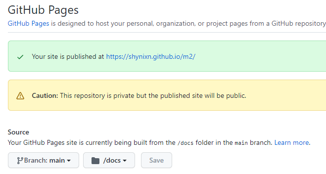

# repository-m2-deploy-action

This GitHub action turns one of your repositories on GitHub into a fully working maven repository.

### Disclaimer

* Keep fair use in mind.

### Example

* The ``sample-hello-world`` application is deployed to the github pages site of my private github repository
  called ``m2``.
* After adding the repository url, it can be used like any other dependency. 

```kotlin
repositories {
    maven("https://shynixn.github.io/m2/repository/releases")
}
dependencies {
    implementation("com.github.shynixn.samplehelloworld:sample-hello-world:1.0.0")
}
```

```Java
new HelloWorld().say();
```

### Background

Continuously deploying open source or closed source artifacts such as ``.jar``, ``-javadoc.jar``, ``-sources.jar`` and
more is not an easy task. Many configurations need to be set in maven and gradle build files such
as ``pom.xml`` ``build.gradle`` in order to ensure a correct deployment. This makes maintaining these files over a long
period of time very complicated as all things need to match the used gradle version, java, scala or kotlin version.
Also, in order to use such deployed dependencies in ``pom.xml`` ``build.gradle`` files, they need to be available from
the web and hosted by an authority.

This github action tries to solve these issues by providing simple to advanced configurations options to host your own
dependencies in a github repository.

## Setup

### 1. Create your own free maven repository

1. Create a new public or private repository on your gihub account called ``m2`` (other names are allowed as well).
2. Create a docs folder (you may need to add any file into it so it gets added to git).
3. Setup github-pages in the repository settings of your repository.



### 2. Setup your repository and workflow

1. Switch to the GitHub repository where your project is located.
2. Generate a new personal access token in the Github/Developer Settings with repository write permissions.
3. Store this personal access token in your repository secrets with key ``PERSONAL_ACCESS_TOKEN``.
4. Edit your GitHub workflow file.

**Simple config**
```yaml
uses: Shynixn/repository-m2-deploy-action@v1.1.0
with:
  # Required - Set the relative file path from the repository root to the jar file you want to deploy. 
  # The name does not need to follow any naming convetions, it is automatically renamed according to the maven.
  primary-jar-file: 'sample-hello-world/build/libs/sample-hello-world-1.0.0.jar'
  # Required - Set the maven group id.
  group-id: 'com.github.shynixn.samplehelloworld'
  # Required - Set the maven artifact id.
  artifact-id: 'sample-hello-world'
  # Required - Set the maven version id.
  # Existing releases are simply overwritten if the jar file with this version was already deployed. 
  # You can use the github.run_number environment variable to have automatically incrementing version: 1.0.${{ github.run_number }} 
  version-id: 1.0.0
  # Required - Used to access another repository of your or another github account to pull and push data from.
  # We cannot use GITHUB_TOKEN because the GITHUB_TOKEN does not have permissions to post to other private repositories. 
  github-token: ${{ secrets.PERSONAL_ACCESS_TOKEN }}
  # Required - Owner of the github repository you are using as maven repository. 
  github-username: 'Shynixn'
  # Required - Name of the github repository you are using as maven repository.
  github-repository: 'm2'
```

5. Deploy a release and see if the files were correctly added to your repository.
6. Access the files in another project.

```kotlin
repositories {
    maven("https://<yourusername>.github.io/m2/repository/releases")
}
dependencies {
    implementation("your-deployed-artifact")
}
```

## Advanced Configuration

```yaml
uses: Shynixn/repository-m2-deploy-action@v1.1.2
with:
  # Required - Set the relative file path from the repository root to the jar file you want to deploy. 
  # The name does not need to follow any naming convetions, it is automatically renamed according to the maven.
  primary-jar-file: 'sample-hello-world/build/libs/sample-hello-world-1.0.0.jar'
  # Required - Set the maven group id.
  group-id: 'com.github.shynixn.samplehelloworld'
  # Required - Set the maven artifact id.
  artifact-id: 'sample-hello-world'
  # Required - Set the maven version id.
  # Existing releases are simply overwritten if the jar file with this version was already deployed. 
  # You can use the github.run_number environment variable to have automatically incrementing version: 1.0.${{ github.run_number }} 
  version-id: 1.0.0
  # Required - Used to access another repository of your or another github account to pull and push data from.
  # We cannot use GITHUB_TOKEN because the GITHUB_TOKEN does not have permissions to post to other private repositories. 
  github-token: ${{ secrets.PERSONAL_ACCESS_TOKEN }}
  # Required - Owner of the github repository you are using as maven repository. 
  github-username: 'Shynixn'
  # Required - Name of the github repository you are using as maven repository.
  github-repository: 'm2'
  # Optional - Base64 Encoded Ascii armored version of the secret key.
  signing-key: ${{ secrets.SIGNING_KEY }}
  # Optional - Password of the secret key.
  signing-password: ${{ secrets.SIGNING_PASSWORD }}
```

### Signing

#### Generating a public key

1. Download GnuPG from https//www.gnupg.org/download/
2. Generate a new key ``gpg --gen-key``
3. Display your key ``gpg --list-keys``
4. Publish your public key to official key servers (parameter yourPulicKey looks similar to BEF88AF6D2A36D3D64EB471460D083CF7EE3A581)

```shell
gpg --keyserver keyserver.ubuntu.com --send-keys <yourPublicKey>
```

#### Signing files

1. Export the private key to a file

```shell
gpg --output secret-key.txt --armor --export-secret-key
```

2. Encode the text of the file into a single base64 string without any line breaks
3. Copy this string and store it in your repository secrets with key ``SIGNING_KEY``.
4. Store the password of your private key in your repository secrets with key ``SIGNING_PASSWORD``.


TODO: // Implement signing, javadocs and more parameters.


